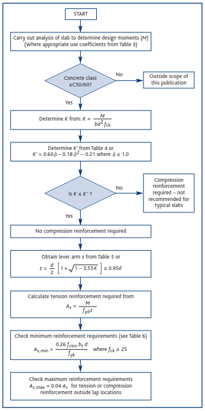
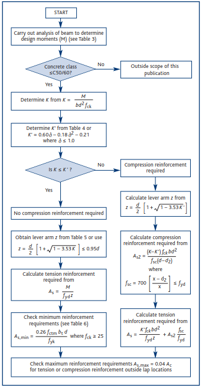
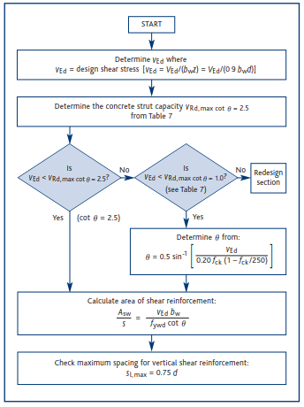
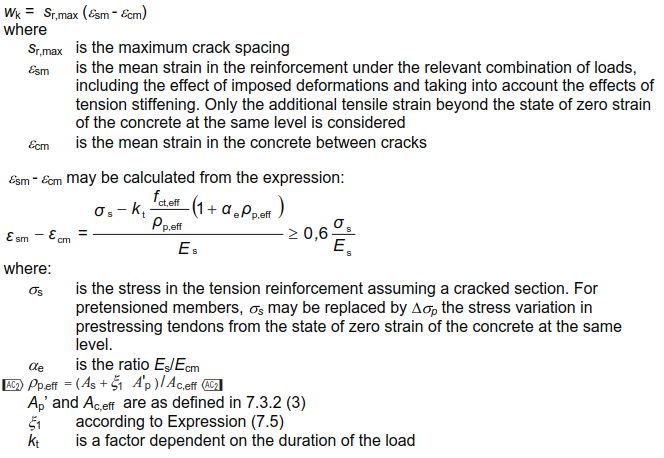

# rc-geometry-designer

### App Description

#### General Info

The app allows for carrying out reinforced concrete design of a slab or beam section in accordance with Eurocode 2 (EC2). This involves checking the section against bending, shear(beam only) and cracking(optional).

A user specifies design forces in the section (ULS and SLS), element type (slab or beam) and sets up the section in three different views:

- **Geometry:** Setting up slab thickness or beam depth and width. **Beam calculations support only rectangular section.**
- **Reinforcement:** Setting up main reinforcement for bending and shear links (if beam calculations).
- **Design parameters:** miscellaneous parameters needed for the design such as: nominal cover, concrete class, yield strength, partial factors of safety etc.

Once these are done, a user can click calculate to generate results in the main view. The results show utilization for specified checks and state whether section is adequate or not.

The app allows for saving the project to a file and loading a project from existing file. It also includes a section preview that draws the section in the main view showing its dimensions and reinforcement.

#### Calculations

The calculations are carried out in accordance with:
- *BS EN 1992-1-1:2004, Eurocode 2: Design of concrete structures* — Part 1-1: General rules and rules for buildings
- *NA to BS EN 1992-1-1:2004, UK National Annex to Eurocode 2: Design of concrete structures* — Part 1-1: General rules and rules for buildings

A Concrete Centre guide *How to Design Concrete Structures using Eurocode 2* (January 2011) was also used in the project to supplement the EC2 logic.

##### Bending

Slab bending reinforcement was calculated using following procedure:



Beam bending was assessed using:



##### Shear

The procedure for shear calculation:



##### Cracking

Crack widths were calculated using formulas found in cl. 7.3.4 in EC2:



### Built With

Java 14, JavaFX 14, FXML, CSS

### Project Configuration

Using Java 14 SDK and Java 14 as a project language level.

### Tested With

JUnit 5, TestFx, AssertJ, Mockito

### Deployment

The project is built using Gradle 6.3 and using [JLink](https://github.com/beryx/badass-jlink-plugin) v.2.1.7 plugin to deploy the application - jpackage and application image.

To build the application - fat jar creation:

```groovy
gradle build
```

Application image creation:

```groovy
gradle jlink
```

To run the application image:

```
build\image\bin\java.exe -m com.radsoltan/com.radsoltan.EntryPoint
```

Installation file creation (uses incubator modules jdk.incubator.jpackage):

```groovy
gradle jpackage
```

### Authors

Radoslaw Soltan